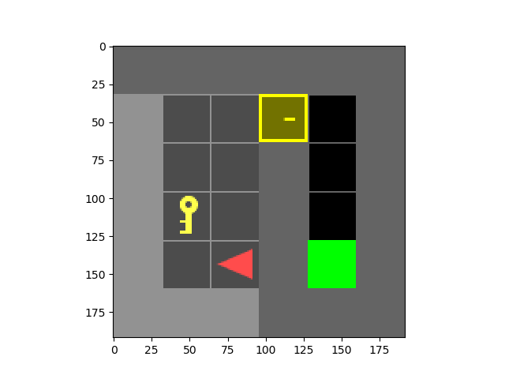
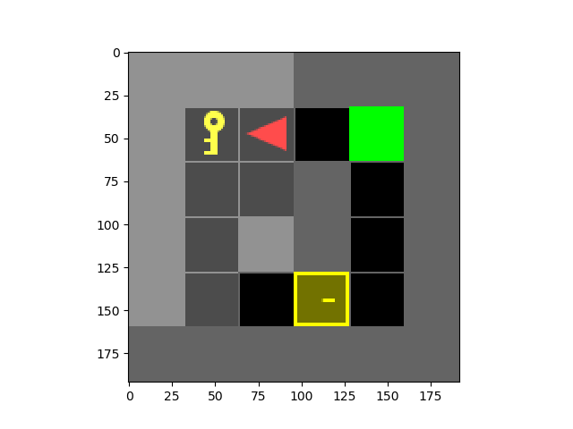

# ECE276B SP21 HW1 Programming Assignment

## Overview
Implemented dynamic programming using Label Correcting (LC) for autonomous navigation in a door and key environment for a static target. Executed and evaluated the performance of the algorithms on various known and unknown maps with random target spawns and multiple doors/keys.

<p align="center">
</br>
</p>

There are 7 test scenes included in the report.

| doorkey-5x5-normal |
|:----------------:|
|  |

| doorkey-6x6-normal   | doorkey-6x6-direct | doorkey-6x6-shortcut |
|:----------------:|:------------------:|:----------------:|
|  |  ||

| doorkey-8x8-normal   | doorkey-8x8-direct | doorkey-8x8-shortcut |
|:----------------:|:------------------:|:----------------:|
|  |  ||

## Installation

- Install [gym-minigrid](https://github.com/maximecb/gym-minigrid)
- Install dependencies
```bash
pip install -r requirements.txt
```

